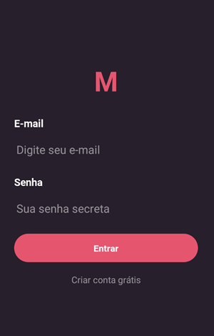

# Desafio Final - APLICATIVO MEETAPP

Nesse desafio foi construida uma aplicação completa envolvendo back-end com NodeJS, e mobile com React Native.

Foi desenvolvida uma aplicação para agregar informações de meetups, ou seja, os usuários poderão cadastrar eventos sobre programação na aplicação e outros usuários poderão se inscrever e
comentar sobre.

A aplicação chamada “Meetapp” possuirá a funcionalidade principal de gerenciamento de
meetups entre programadores. Os meetups são encontros feitos por grupos de pessoas para
discutir assuntos diversos.

A aplicação conta com sistema de login e cadastro, listagem de próximos meetups,
meetups recomendados (os quais são exibidos a partir das preferências do usuário), busca e
edição de perfil.

O link para o backend deste aplicativo se encontra aqui:

https://github.com/dbins/rocketseat_backend

Neste aplicativo foi utilizado o React Native CLI, estilização através de Styled Components, React Navigation, Redux e Redux Saga.

## Instalação

- git clone
- npm install
- Ative o backend junto com a fila de disparos de e-mails (Redis)
- Edite o arquivo /services/api com o endereço da API
- Abra o emulador. Os testes foram feitos utilizando o emulador Genymotion (Android)
- react-native run-android

## Requisitos Funcionais

**Usuário/Autenticação**

- O usuário pode se cadastrar com nome, e-mail e senha;
- O usuário pode realizar login utilizando e-mail e senha;
- O usuário pode escolher suas preferências de tecnologias no primeiro login ou alterando seu perfil;
- O usuário poder editar seu perfil, alterando nome, senha e preferências;

**Meetups**

- O usuário pode listar os próximos meetups que ainda não é inscrito;
- O usuário pode listar os meetups os quais está inscrito e acontecerão em breve;
- O usuário pode listar os próximos meetups recomendados (de acordo com suas preferências) que ainda não é inscrito;
- O usuário pode visualizar detalhes do evento como foto de capa, título, descrição, número de inscritos e local de realização;
- O usuário pode cadastrar um novo meetup;
- O usuário pode realizar inscrição no meetup;
- O usuário pode buscar por meetups pelo título;
- As preferências são fixas e não podem ser alteradas: Front-end, Back-end, Mobile, DevOps, Gestão e Marketing;
- Ao se inscrever no meetup, o usuário recebe um e-mail de confirmação de participação;
